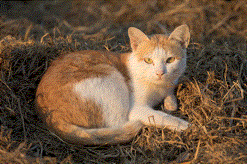

# Markdown test

* plain text
* `inline code`
* _italic text_
* **bold text**
  * **_bold italic text_**

## Code blocks

```python
import requests

response = requests.get(
    'https://httpbin.org/get',
    params={'page': '1'},
)
print(response.text)
print(response.headers)
```

```bash
for i in {1..10}; do
    echo "Hello, world $i!"
done
```

## Images
wow look at this cat



## Important status update
how else will people know this is a work in progress

oh man this is going to look so cool when it's done


    

## Cards
::::{grid} 1 2 2 2
:::{grid-item-card} Computing
* Microcontrollers: ESP32
* SBCs: Raspberry Pi, Orange Pi
* MiniPCs
:::
:::{grid-item-card} Input devices
* Mechanical keyboards
* Trackballs
* Toggle switches
:::
::::

::::{grid} 1 2 3 3
:::{grid-item-card} {fab}`python` Open Source
:link: open-source
:link-type: ref
:::
:::{grid-item-card} {fas}`seedling` Cactus & succulents
:link: succulents
:link-type: ref
:::
:::{grid-item-card} {fas}`camera` Photography
:link: photography
:link-type: ref
:::
::::

## Xrefs
<!-- https://myst-parser.readthedocs.io/en/latest/syntax/cross-referencing.html -->
Cross-reference formats:
* Explicit target: [](#about-site)
* Link to source file: [](about-site.md)
* Autolink by page name: <project:#about-site>
* Autolink by source file name: <project:./about-site.md>
* Doc: {doc}`about-site`
* Ref: {ref}`about-this-site`
* Separately defined ref: [][label]
* [_Explicit_ **Markdown** `text`](<about-site> "optional explicit title")

[label]: about-site
