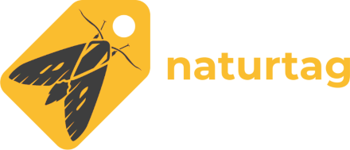

(open-source)=
# {fab}`python` Open Source
```{tags} code, python
```

I develop and maintain a few open source projects, mainly python libraries.
Here are a few of the most interesting ones:

## requests-cache


My largest project is currently **requests-cache**, which is an HTTP caching library for python.

* {fas}`code` Source: https://github.com/requests-cache/requests-cache
* {fas}`book` Docs: https://requests-cache.readthedocs.io

## pyinaturalist


I also work on a number of projects related to biodiversity data. The most mature of these is **pyinaturalist**, which is a python library for interacting with [iNaturalist](https://www.inaturalist.org/).

* {fas}`code` Source: https://github.com/pyinat/pyinaturalist
* {fas}`book` Docs: https://pyinaturalist.readthedocs.io

## Naturtag


A related but less mature project I'm currently developing is **Naturtag**, which is a desktop
application and CLI tool for nature photographers. Its goal is to simplify photography workflow and
organization by embedding useful biodiversity metadata into image files using
[XMP](https://exiftool.org/TagNames/XMP.html) and [Darwin Core](https://www.tdwg.org/standards/dwc).

It's a really fun project to work on, because I'm primarily making it for myself, and it's in a
relatively small niche that no other tools (that I know of) currently fill.

* {fas}`code` Source:  https://github.com/pyinat/naturtag
* {fas}`book` Docs: https://naturtag.readthedocs.io

## Other
* A number of other small projects can be found [on my GitHub profile](https://github.com/jwcook)
* This site and any other tilde-specific repos will be on [tildegit](https://tildegit.org/jwcook)
