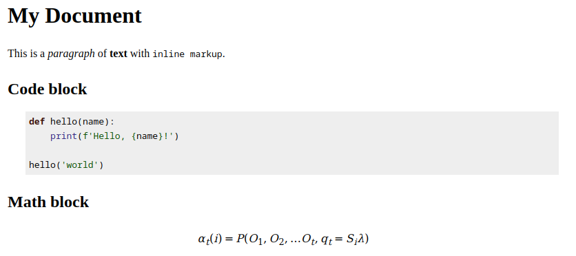
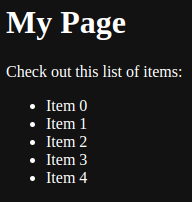
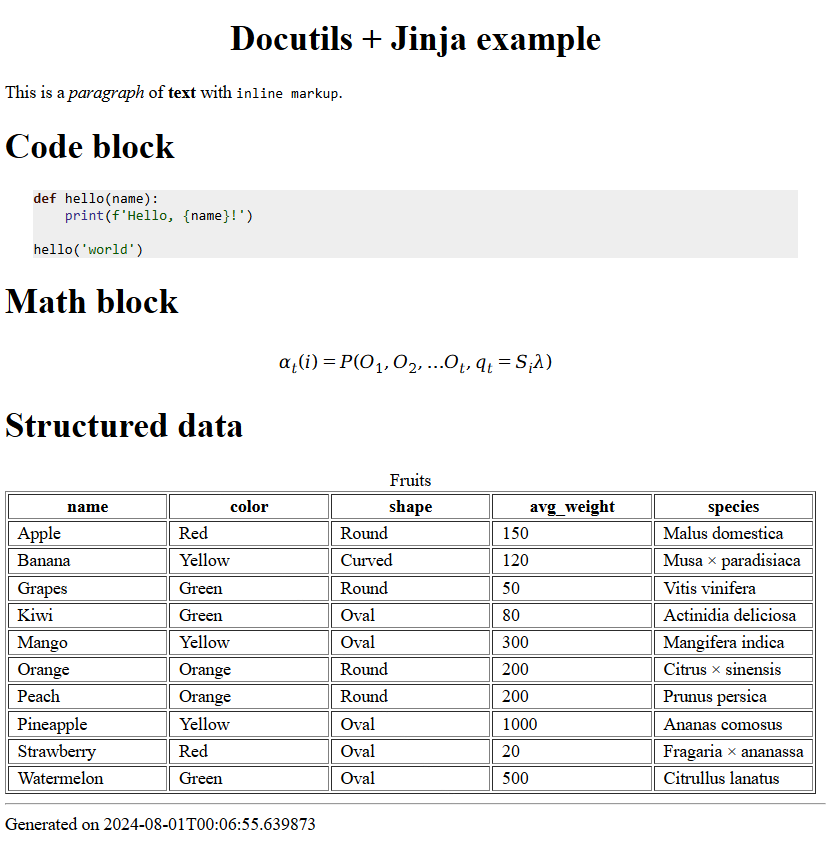

# Website Setup Part 1: Sphinx Building Blocks
::::{grid} 1 1 3 3
:::{grid-item}
```{tags} status:draft, web, code
```
:::
:::{grid-item}
Posted **2024-09-01**
:::
:::{grid-item}
:::
::::
% TODO: header image

For my first few posts here, I'd like to write about the tools used to build this site.
This won't be a tutorial, since there are plenty of great ones already out there!
I will focus less on _how to do it_ and more on _how it works_, and probably in more detail than necessary.

## Purpose
Why? Because this is stuff I wish I knew years ago when getting started! One thing I struggled with
while learning these things, particularly intermediate-to-advanced Sphinx usage, was **assumed knowledge**.
I've encountered a lot of docs and tutorials that seem to assume understanding of not just the public API
of the tools and their current state, but their long, complex history and underlying mechanics.

I'm not going to dive _that_ deep, but I'll at least summarize some of the lower-level bits that directly
inform how and why the higher-level bits work.
This will start out a bit rudimentary, but if you want an idea of where this is headed, take a look at the
[source documents](https://github.com/JWCook/jwcook.dev/tree/main/pages) for the site you're looking at right now.

## Static sites
Like most personal websites, this is a **static site** made of HTML, CSS, and a bit of JS.
If you're not familiar with [static site generators](https://en.wikipedia.org/wiki/Static_site_generator) (SSGs),
here's a very brief recap:

:::{card}
:text-align: center
{fas}`file-lines;sd-text-primary` plaintext documents (in some markup language)<br/>
{fas}`plus;sd-text-primary`<br/>
{fas}`code;sd-text-primary` templates (in some template engine)<br/>
{fas}`plus;sd-text-primary`<br/>
{fas}`gears;sd-text-primary` static site generator<br/>
{fas}`equals;sd-text-primary`<br/>
  
:::

That website can then be hosted anywhere. It's just files on
[someone else's computer](https://www.cloudflare.com/learning/cloud/what-is-the-cloud/), not a web application,
so there's no need to set up a specialized server. This comes with limitations, of course, but drastically simplifies
the setup and maintenance. The tradeoff is well worth it for most hobbyists, and quite a few professional uses too.

In other words, [you don't need Kubernetes to host fruit jokes](https://festivus.dev/kubernetes).

## Sphinx intro
For this site, it all starts with [Sphinx](https://www.sphinx-doc.org), which is a static site generator,
and more specifically a **documentation generator**. This means it doesn't just make your text look pretty,
it has features for dynamically generating and modifying content, mainly geared toward software and other technical documentation.
For example, you can point it at some code with comments, and it will use that info to create some nicely formatted API docs.

Sphinx's original purpose was documenting the python language, starting with version [2.6](https://docs.python.org/2.6/) in 2008.
Needless to say, it has progressed a lot since then! After a decade and a half the project is still going strong, and
[some remarkable people](https://www.sphinx-doc.org/en/master/authors.html) have been responsible for that.

If you've ever read docs for an application or library on [Read the Docs](https://readthedocs.io), you've probably seen
sites built with Sphinx. (example: a snippet of `requests`
[source code](https://github.com/psf/requests/blob/0e322af87745eff34caffe4df68456ebc20d9068/src/requests/api.py#L14-L53) and
[corresponding docs](https://requests.readthedocs.io/en/latest/api/#requests.request)).

% TODO: show a bit about scientific computing docs / books

But before diving into Sphinx itself, I want to start by introducing some of the lower-level tools that it's built on.

## Docutils
% TODO: header image, maybe an stylized representation of [markup] -> [HTML]

[Docutils](https://docutils.sourceforge.io) is a document processing engine that takes plaintext markup and converts it
into other useful formats.
* **Inputs:** Its reference implementation is built around the
  [reStructuredText](https://docutils.sourceforge.io/rst.html) (rST) markup language, but it can be extended to work
  with other formats.
* **Outputs:** We're mainly interested in the HTML output right now, but also supports things like LaTeX and manpages.

### Docutils rST conversion example
Here is a simple example of an rST document:
:::{dropdown} `example.rst`
```rst
My Document
-----------

This is a *paragraph* of **text** with ``inline markup``.

Code block
==========

.. code:: python

    def hello(name):
        print(f'Hello, {name}!')

    hello('world')

Math block
==========

.. math::

  α_t(i) = P(O_1, O_2, … O_t, q_t = S_i λ)

```
:::

It can be converted using the `docutils` CLI:
```sh
docutils example.rst output.html
```

Or the `docutils` python package:
```py
from docutils.core import publish_string
html_content = publish_string(open('example.rst').read(), writer_name='html')
```

Which produces output like this:
:::{dropdown} output.html

:::

### Docutils directives
Importantly, Docutils introduces the concept of **directives**, which are blocks of markup that take arguments as input
(sometimes including more markup) and can dynamically generate output. The `code` and `math` blocks above are examples.

At its most basic, a directive can add some extra styling to the output.
For example, a highlighted warning, which looks like this in rST:

```rst
.. warning::
   This function is deprecated!
```

And produces output like this:
```{warning}
This function is deprecated!
```

Directives can do a lot more than just styling. For example, some handle structured data, like `csv-table`:
```rst
.. csv-table:: Fruits
    :file: data/fruit.csv
    :header-rows: 1
```

That takes an input CSV file [like this](../../assets/data/fruit.csv), and produces output like this:
:::{dropdown} Table output
```{csv-table} Fruits
:file: ../../assets/data/fruit.csv
:header-rows: 1
```
:::

Directives also happen to be one of the main ways Docutils can be extended. In other words, you can write
**python code that takes markup as input**, and does whatever processing you want. In a future post I plan to cover
how to make custom directives, but that's enough about them for now.

### Sphinx + Docutils
Sphinx uses Docutils for its core document processing, but most of it is abstracted away and extended by Sphinx.
As a user, the Docutils features you may still interact directly with are:
* rST markup, if you choose to stick with the default (more on that later!)
* Structural elements like sections, field lists, footnotes, citations, and references
* [Basic directives](https://www.sphinx-doc.org/en/master/usage/restructuredtext/basics.html#directives)
  for things like tables, images, and "admonitions" (notes, tips, warnings, etc.)
* Base classes and functions for building extensions

## Jinja
% TODO: header image, maybe some stylized {{ }} brackets

[Jinja](https://jinja.palletsprojects.com) is a **template engine**, in the same category of tool as
[Nunjucks](https://mozilla.github.io/nunjucks/) (inspired by Jinja),
[Pug](https://github.com/pugjs/pug), and
[mustache](https://github.com/janl/mustache.js).
You're likely already familiar, but **templates** let you insert basic programming logic (variables, conditionals,
loops, reusable blocks, etc.) into otherwise static plaintext files.

It can be used to template any kind of text document, but here it is mostly used to template HTML.
This is another main ingredient that enables Sphinx to dynamically generate content.

### Jinja example
Here is a simple example of a Jinja HTML template:
:::{dropdown} `template.html`
```html
<!DOCTYPE html>
<html>
<head>
    <title>{{ title }}</title>
</head>
<body>
    <h1>{{ title }}</h1>
    <p>{{ content }}</p>
    <ul>
        
            <li>{{ i }}</li>
        
    </ul>
</html>
```
:::

You can then generate a page from this template in python:
:::{dropdown} `render_template.py`
```python
from jinja2 import Template

template = Template(open('template.html').read())
rendered = template.render(
    title='My Page',
    content='Check out this list of items:',
    items=[f'Item {i}' for i in range(5)],
)
with open('output.html', 'w') as f:
    f.write(rendered)
```
:::

Which renders output like this:
:::{dropdown} `output.html`
```html
<!DOCTYPE html>
<html>
<head>
    <title>My Page</title>
</head>
<body>
    <h1>My Page</h1>
    <p>Check out this list of items:</p>
    <ul>
        <li>Item 0</li>
        <li>Item 1</li>
        <li>Item 2</li>
        <li>Item 3</li>
        <li>Item 4</li>
    </ul>
</html>
```


:::

### Sphinx + Jinja
Sphinx adds its own abstraction on top of Jinja, so you don't typically render pages directly with `Template.render()`
like the example above. Template variables come from Sphinx-specific features and config, and template rendering is run by
Sphinx in one of several build steps.

Sphinx also provides **base templates** for common page elements and layout, which are extended by third-party
[themes](https://sphinx-themes.org). However, you are free to modify, extend, or completely replace these templates.

There is a lot you can do with these templates to customize the structure and style of your site, but I'll save that for
a future post.

## Docutils + Jinja
So far the ingredients we have are:
* Core document processing that converts markup into (among other things) HTML
* Directives that can make your **content** programmable
* Templates that can make your **layout and style** programmable

Next, let's make a simple HTML page that shows how Docutils and Jinja can work together.
This isn't how you'd typically use them, but it illustrates a bit of what Sphinx does under the hood.

First, let's take an rST document that will form the page's body:
:::{dropdown} `example.rst`
```rst
Docutils + Jinja example
------------------------

This is a *paragraph* of **text** with ``inline markup``.

Code block
==========
.. code:: python

    def hello(name):
        print(f'Hello, {name}!')

    hello('world')

Math block
==========
.. math::

  α_t(i) = P(O_1, O_2, … O_t, q_t = S_i λ)

Structured data
===============
.. csv-table:: Fruits
    :file: assets/data/fruit.csv
    :header-rows: 1

```
:::

And a template that defines the layout:
:::{dropdown} `template.html`
```html
<!DOCTYPE html>
<html>
<head>
    {{ head }}
    {{ style }}
</head>
<body>
    {{ body }}
</body>
<footer>
    <hr/>
    Generated on {{ timestamp }}
</footer>
</html>
```
:::

And glue it together with a bit of python:
:::{dropdown} `render.py`
```python
from datetime import datetime
from docutils.core import publish_string, publish_parts
from jinja2 import Template

# Convert the rST file into HTML, but split into separate parts
html_parts = publish_parts(
    open('example.rst').read(),
    writer_name='html',
)

# Plug those parts into the template and render a full page
template = Template(open('template.html').read())
rendered = template.render(
    head=html_parts['head'],
    style=html_parts['stylesheet'],
    body=html_parts['html_body'],
    timestamp=datetime.now().isoformat(),
)
with open('output.html', 'w') as f:
    f.write(rendered)
```
:::

Which produces a page like this:
:::{dropdown} `output.html`

:::

## Up next
Next, we'll move on to using Sphinx itself, and an overview of the features it adds on top of these basic tools.
